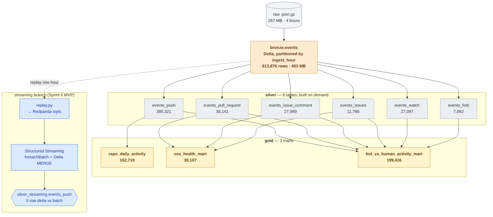
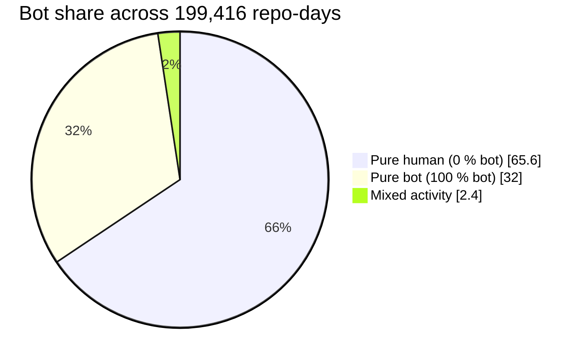
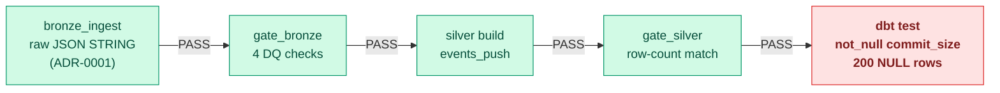

# OSS Pulse

> Production-grade GitHub activity lakehouse on **Delta + dbt + Spark + Airflow**.
> 613,876 events through Bronze → Silver → Gold, gated by 18 data-quality checks
> at every layer boundary, with a real deliberately-induced incident, an
> honest performance report, and a streaming MVP that reconciled 181,221
> events against batch with **zero row delta**.

[](https://github.com/MistFall-Wang/oss-pulse/actions/workflows/ci.yml)
&nbsp;


**[→ Visual showcase site](https://mistfall-wang.github.io/oss-pulse/)** &nbsp;·&nbsp; **[Master plan](docs/PROJECT_PLAN.md)** &nbsp;·&nbsp; **[ADRs](docs/adr/)** &nbsp;·&nbsp; **[Runbooks](docs/runbooks/)** &nbsp;·&nbsp; **[Postmortem 0001](docs/postmortems/0001-schema-drift.md)**

---

## At a glance

| Bronze events | Delta tables | dbt tests | DQ gates | Accepted ADRs | Runbooks | Postmortems | Batch↔stream Δ |
|:-:|:-:|:-:|:-:|:-:|:-:|:-:|:-:|
| **613,876** | **11** | **100+** | **18** | **7** | **5** | **1** | **0.0000 %** |

---

## Architecture

End-to-end medallion with a parallel streaming branch. Bronze stores `payload`
as raw JSON STRING so upstream schema drift never crashes ingestion
([ADR-0001](docs/adr/0001-payload-handling.md)). Every layer MERGEs on stable
GitHub ids — no surrogate keys ([ADR-0004](docs/adr/0004-no-surrogate-keys.md)).
Silver tables are built only when a Gold mart needs them
([ADR-0005](docs/adr/0005-silver-build-strategy.md)).



---

## Findings from the data

### Bot vs human activity, per repo-day

Across 199,416 (repo, day) rows in `bot_vs_human_activity_mart`, the
distribution is bimodal — most repo-days are entirely human or entirely bot,
with only a small "interesting tail" of mixed activity.



> Roughly one third of repo-days are 100 % automated traffic. This is the
> headline OSS-health finding — and exactly what made the Sprint 2.5 spike
> flag that the original bot rule needed a curated allowlist (`Rule C` in
> [ADR-0006](docs/adr/0006-bot-identification.md)), not just the `[bot]` suffix.

### Top bots by event count

`github-actions[bot]` dominates the bot signal in the sample. `LombiqBot`
is the visible miss for `[bot]`-suffix detection; the
[`known_bots.csv` allowlist](dbt/seeds/known_bots.csv) catches it via Rule C.

```
github-actions[bot]       ████████████████████████████████████████  129,533
renovate[bot]             ██                                          6,480
dependabot[bot]           ██                                          6,203
pull[bot]                 █▍                                          4,491
swa-runner-app[bot]       █                                           3,635
LombiqBot ◄ Rule C        ▌  no [bot] suffix; allowlist catches it    1,752
sonarqubecloud[bot]       ▍                                           1,274
coderabbitai[bot]         ▍                                           1,108
```

### Top 10 multi-author repos on 2025-01-15

Filtered to `unique_pushers ≥ 5` to surface real OSS projects vs
single-actor automation.

| repo_name              | push_count | total_commits | unique_pushers | bot_push_count |
|------------------------|-----------:|--------------:|---------------:|---------------:|
| `NexusAILab/cdn`       |        131 |           131 |              5 |              0 |
| `odoo-dev/odoo`        |         75 |         2,428 |             49 |              0 |
| `LucasOtw/SAE3_Sco…`   |         69 |            84 |              7 |              0 |
| `hmcts/cnp-flux-co…`   |         38 |            42 |              5 |              0 |
| `demisto/content`      |         36 |           394 |             15 |              6 |
| `ZrenKix/PROJ2024`     |         35 |           236 |              6 |              0 |
| `grafana/grafana`      |         33 |           593 |             20 |              2 |
| `Matteo-K/PACT`        |         32 |            50 |              5 |              0 |
| `deckhouse/deckhouse`  |         30 |            34 |             13 |              0 |
| `MarcusZ98/Racketeers` |         29 |           159 |              7 |              0 |

---

## Batch ↔ streaming reconciliation (Sprint 6 MVP)

Replay one ingest hour of PushEvents to Redpanda → drain via Spark Structured
Streaming + Delta MERGE into a parallel `silver_streaming` table → compare
row-by-row to the batch Silver table for the same hour.

| Metric                  |       Batch |   Streaming |   Δ |
|-------------------------|------------:|------------:|----:|
| rows (`events_push`)    | **181,221** | **181,221** | **+0** |
| `commit_size` Σ         |     576,167 |     576,167 |  +0 |
| ids only in batch       |           — |           — |  0  |
| ids only in streaming   |           — |           — |  0  |

**Threshold:** `< 0.01 %` &nbsp;·&nbsp; **Actual:** `0.0000 %` &nbsp;·&nbsp;
Exactly-once via `foreachBatch` + Delta MERGE on `id` (no separate offset
store needed).

<details>
<summary><b>Reproduce in 4 commands</b></summary>

```bash
docker-compose -f streaming/docker-compose.yml up -d
uv run python -m streaming.replay    --source data/raw/2025-01-15-12.json.gz
uv run python -m streaming.consumer
uv run python -m streaming.reconcile --ingest-hour 2025-01-15-12
```
</details>

---

## The deliberate incident drill

Sprint 5b: synthesize 200 PushEvent rows where `payload.size` was renamed to
`payload.commit_count`, ingest as a new `ingest_hour`, observe which gate
catches it — and what's silently poisoned in between.



| Step | Why it didn't catch (or did) |
|------|------------------------------|
| `bronze_ingest` PASS | Bronze stores `payload` as raw JSON STRING by design ([ADR-0001](docs/adr/0001-payload-handling.md)). The rename is invisible at this layer. |
| `gate_bronze` PASS | 4 checks (id-unique, type-in-set, public, created_at-not-null) all hold; payload contents aren't checked at Bronze. |
| `silver build` PASS | `get_json_object(payload_raw, '$.size')` silently returns NULL on the 200 rows. SELECT projects NULL successfully. |
| `gate_silver` PASS | Silver row count still equals Bronze filtered by type — NULLs are still rows. **This is the gate the postmortem added a regression check to.** |
| `dbt test` **FAIL** | `not_null_events_push_commit_size`: Got 200 results, configured to fail if != 0. |

> **Root cause: gate-placement, not a missing test.** The dbt schema test
> catches it, but it runs at the end of the pipeline — Gold marts would
> already have consumed the bad Silver data. The fix is a one-line
> `coalesce(size, commit_count)` in `events_push.sql` plus a new
> `silver_commit_size_not_null` gate in `quality/checks.py` that moves
> detection between Silver and Gold, where it belongs.

Full 5 Whys + lessons in
[**docs/postmortems/0001-schema-drift.md**](docs/postmortems/0001-schema-drift.md).

---

## Performance — and the honest negative result

Hypothesis: `OPTIMIZE ... ZORDER BY (type)` on Bronze would prune per-type
filter reads in every Silver build. **Result: at this 4-partition scale, it
didn't.** Recording the failure honestly is the experiment's value.

### Per-type filter wall-clock

```
events_push BEFORE         ████████████████████████████  2.73 s   files_read = 4
events_push AFTER          ████████                      0.89 s   files_read = 4   ◄ same prune, "speedup" is JIT warmup

full silver build BEFORE   ████████████████████████████  37.36 s
full silver build AFTER    ████████████████████████████▍ 38.34 s  ◄ no net change
```

### Bronze storage — the 2× temporary spike

```
before OPTIMIZE                ████████████████  465 MB · 4 files
after OPTIMIZE (pre-VACUUM)    ████████████████████████████████  931 MB · 8 files  ⚠ 2×
after VACUUM (dev only, 0h)    ████████████████  466 MB · 4 files
```

> **Why it was a no-op:** ZORDER re-arranges rows *within* a file but can't
> split below the file boundary. At 4 files, the smallest skip-unit is 25 %
> of the table — no prune possible. At 100× scale, worth re-running.
> The 2× storage spike is the empirical reason ADR-0009 (compact-daily,
> vacuum-weekly with 168h retention) is mandatory, not aspirational.
>
> Full 5-dimension report:
> [**docs/performance/sprint5b_tuning.md**](docs/performance/sprint5b_tuning.md).

---

## The seven senior signals — where each one lives

Each row names the artifact that proves the signal, so a reviewer can ask
"show me" instead of trusting the claim.

| # | Signal | Lives in |
|---|--------|----------|
| 1 | **Idempotency** | Bronze + Silver + Gold all MERGE on natural ids; runtime invariants in [`spark/jobs/gold_verify.py`](spark/jobs/gold_verify.py), [`gold_health_verify.py`](spark/jobs/gold_health_verify.py), [`gold_bot_verify.py`](spark/jobs/gold_bot_verify.py) |
| 2 | **Backfill / replay** | Airflow DAG `params.start_hour` / `end_hour`; [`docs/runbooks/backfill.md`](docs/runbooks/backfill.md) |
| 3 | **Schema-drift tolerance** | [ADR-0001](docs/adr/0001-payload-handling.md) (Bronze contract) + [postmortem 0001](docs/postmortems/0001-schema-drift.md) (proven under a real injected break) |
| 4 | **DQ gates** | [`quality/runner.py`](quality/runner.py) — 18 checks across 4 suites, each exits non-zero to gate the next Airflow task |
| 5 | **Perf tuning report** | 5-dimension before/after with an honest negative result in [`docs/performance/sprint5b_tuning.md`](docs/performance/sprint5b_tuning.md) |
| 6 | **Batch + streaming story** | [`streaming/`](streaming/) — 181,221 events reconciled with 0 row delta |
| 7 | **Operational docs** | 7 ADRs + 5 runbooks + 1 postmortem + 3 mart design docs + 1 spike report |

---

## ADR registry

Every irreversible decision (storage format, partition strategy, primary key,
bot rule…) gets an MADR-lite Architecture Decision Record with context,
alternatives rejected, and revisit conditions.

| # | Title | Status |
|---|-------|--------|
| 0001 | [Bronze payload as raw JSON STRING + bounded probe](docs/adr/0001-payload-handling.md) | ✅ Accepted |
| 0002 | [`event_id` as sole idempotency key](docs/adr/0002-event-id-idempotency.md) | ✅ Accepted |
| 0003 | [Partition Bronze by `ingest_hour`, ZORDER by `created_at`](docs/adr/0003-partition-by-ingest-hour.md) | ✅ Accepted |
| 0004 | [No surrogate keys; use GitHub source ids directly](docs/adr/0004-no-surrogate-keys.md) | ✅ Accepted |
| 0005 | [Silver build strategy (tiered, demand-driven) + dbt adapter swap plan](docs/adr/0005-silver-build-strategy.md) | ✅ Accepted |
| 0006 | [Bot rule: Rule A (`[bot]` suffix) + Rule C (allowlist) + event-level `is_app_event`](docs/adr/0006-bot-identification.md) | ✅ Accepted |
| 0007 | [Bronze storage overhead — 1.7× raw `.json.gz`, planning constants](docs/adr/0007-bronze-storage-overhead.md) | ✅ Accepted |
| 0008 | Streaming time semantics (event vs processing time) | ⏳ Sprint 7 (optional) |
| 0009 | OPTIMIZE / VACUUM cadence — preview captured in `sprint5b_tuning.md` | ⏳ Sprint 9 (optional) |

---

## Sprint timeline

Original 6-week estimate revised to a realistic 8–10 weeks. Streaming was
de-scoped from a 4-week build to a 1-week MVP that ships the talking point.

```mermaid
flowchart LR
    S0["Sprint 0<br/>Schema discovery<br/>ADR-0001"]:::done
    S1["Sprint 1<br/>Bronze + first Silver<br/>ADR-0002, 0003"]:::done
    S2["Sprint 2 + 2.5<br/>First Gold mart<br/>bot heuristic spike"]:::done
    S3["Sprint 3<br/>2 more marts<br/>ADR-0005, 0006"]:::done
    S4["Sprint 4<br/>DQ gates · Airflow<br/>4 runbooks"]:::done
    S5b["Sprint 5b<br/>CI · perf · postmortem<br/>ADR-0007"]:::done
    S5a["Sprint 5a<br/>Terraform · IAM<br/><i>apply pending AWS</i>"]:::partial
    S6["Sprint 6<br/>Streaming MVP<br/>0 row delta"]:::done
    S79["Sprint 7-9<br/>Streaming prod-grade<br/>(backlog)"]:::pending

    S0 --> S1 --> S2 --> S3 --> S4 --> S5b --> S5a --> S6 -.-> S79

    classDef done    fill:#d1fae5,stroke:#059669,color:#064e3b
    classDef partial fill:#fef3c7,stroke:#d97706,color:#5d3a05
    classDef pending fill:#f3f4f6,stroke:#6b7280,color:#374151
```



---

## Layout

```text
spark/                  PySpark jobs
  jobs/                 bronze_ingest · bronze_inspect · gold_verify ·
                        gold_health_verify · gold_bot_verify ·
                        bot_heuristic_spike · perf_bench · perf_vacuum ·
                        incident_inject
  schemas.py            Bronze envelope schema (single source of truth)
  tests/                chispa-style pytest unit tests
quality/                lightweight DQ-gate framework (intentionally not full GE)
  checks.py             per-check functions returning CheckResult
  runner.py             per-layer suite CLI (exits non-zero on fail)
dbt/                    dbt-spark project
  models/silver/        6 event-type tables + schema yml
  models/gold/          3 marts + schema yml
  macros/               register_external_sources · delta_source ·
                        generate_schema_name · is_bot
  seeds/                known_bots.csv (Rule C allowlist, ADR-0006)
airflow/dags/           parameterized end-to-end DAG (oss_pulse_pipeline.py)
streaming/              Sprint 6 MVP (Redpanda + Structured Streaming)
  docker-compose.yml · replay.py · consumer.py · reconcile.py
terraform/              Sprint 5a IaC (S3 + IAM + KMS)
data/                   (gitignored)
  raw/                  GH Archive .json.gz inputs
  bronze/               Delta-backed Bronze table
  streaming/            Sprint 6 silver_streaming table
docs/
  PROJECT_PLAN.md       canonical master plan
  index.html            visual showcase (GitHub Pages from /docs)
  adr/                  ADR-0001 .. 0007
  marts/                per-mart design docs
  runbooks/             backfill · schema_change · data_missing ·
                        airflow_setup · cloud_migration
  postmortems/          0001-schema-drift
  performance/          sprint5b_tuning.md + raw bench JSON
  spikes/               time-boxed validation experiments
.github/workflows/      ci.yml (ruff · pytest · dbt parse + compile)
```

---

## Run it locally

Requires **JDK 17**. Spark 3.5 / Hadoop 3.3.4 still call
`Subject.getSubject`, which was removed in Java 18+. Tested on Amazon
Corretto 17.

```bash
# Setup
git clone https://github.com/MistFall-Wang/oss-pulse && cd oss-pulse
uv sync
export JAVA_HOME=/Library/Java/JavaVirtualMachines/amazon-corretto-17.jdk/Contents/Home
export PATH="$JAVA_HOME/bin:$PATH"
export PYSPARK_SUBMIT_ARGS="--driver-memory 4g pyspark-shell"

# End-to-end on one ingest hour
uv run python -m spark.jobs.bronze_ingest --source data/raw/2025-01-15-12.json.gz --bronze-path data/bronze/events
uv run python -m quality.runner --layer bronze
cd dbt && uv run dbt deps && uv run dbt run --select silver && cd ..
uv run python -m quality.runner --layer silver
cd dbt && uv run dbt run --select gold && cd ..
uv run python -m quality.runner --layer gold
uv run python -m quality.runner --layer cross_mart
cd dbt && uv run dbt test

# Cross-layer verifiers (ground truth on the busiest rows)
uv run python -m spark.jobs.gold_verify
uv run python -m spark.jobs.gold_health_verify
uv run python -m spark.jobs.gold_bot_verify

# Streaming MVP
docker-compose -f streaming/docker-compose.yml up -d
uv run python -m streaming.replay --source data/raw/2025-01-15-12.json.gz
uv run python -m streaming.consumer
uv run python -m streaming.reconcile --ingest-hour 2025-01-15-12

# Deliberate incident drill (Sprint 5b)
uv run python -m spark.jobs.incident_inject
# ... observe each gate ...
uv run python -m spark.jobs.incident_inject --cleanup
```

---

## Status & next steps

| State | What it means |
|-------|---------------|
| ✅ Sprint 0 – 6 done | Bronze → Silver → Gold + DQ + Airflow + CI + perf + postmortem + streaming MVP all shipped |
| ⚠ Sprint 5a code-complete | Terraform + cloud-migration runbook ready; `terraform apply` requires user-side AWS account + Databricks Free Edition signup ([runbook](docs/runbooks/cloud_migration.md)) |
| ⏳ Sprint 7–9 backlog | Streaming production-grade (time-warped replay, watermarks, continuous reconciliation, ADR-0008, 0009). Triggered only by job-market signal. |

---

<sub>Built by **Peter Wang** as a portfolio for Canadian Senior Data Engineer roles. The full master plan lives in [`docs/PROJECT_PLAN.md`](docs/PROJECT_PLAN.md). For the interactive visual showcase: [**mistfall-wang.github.io/oss-pulse**](https://mistfall-wang.github.io/oss-pulse/).</sub>
